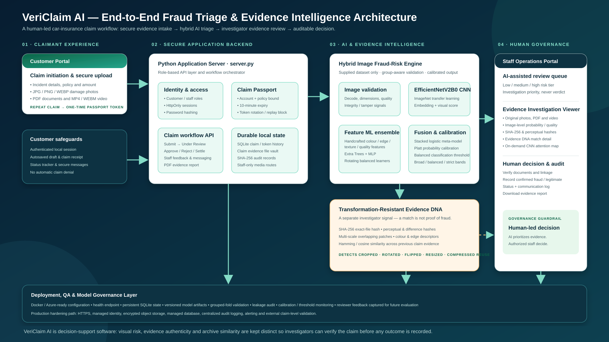
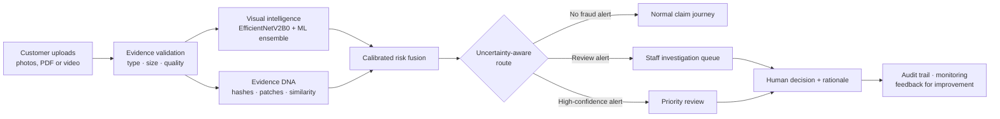
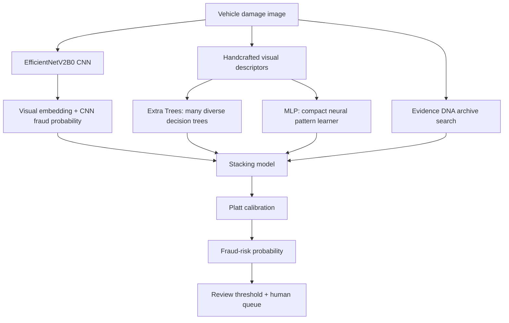
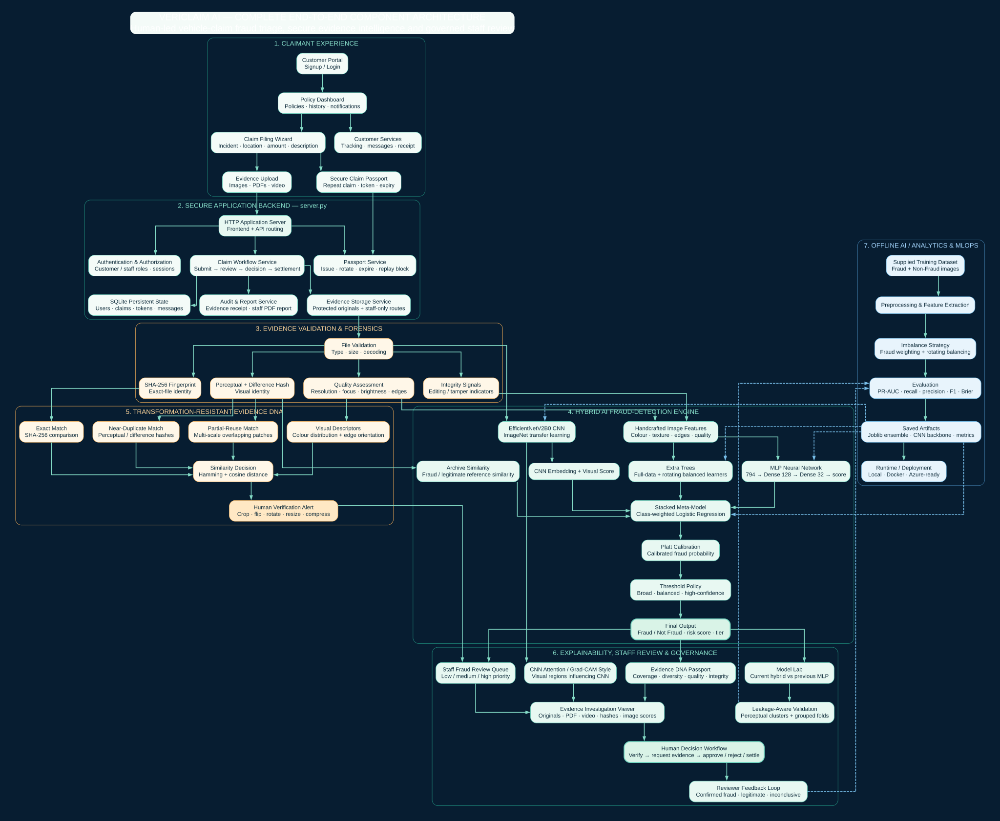

<p align="center">
  
</p>

<p align="center">
  <a href="https://github.com/krishikesannn/vericlaim-ai/actions/workflows/ci.yml"></a>
  
  
  
  
</p>

<h1 align="center">VeriClaim AI</h1>

<p align="center">
  <strong>Evidence intelligence for vehicle-insurance claim triage.</strong><br>
  A transparent fraud-risk workflow that combines visual learning, evidence reuse detection,<br>
  integrity checks and investigator-led decisions.
</p>

> **Decision support, never automatic denial.** A risk score prioritizes a human review; it does not prove deception or determine a claim outcome.

## Why VeriClaim stands out

| Conventional image classifier | VeriClaim evidence-intelligence workflow |
| --- | --- |
| Outputs only “fraud / non-fraud” | Separates a model alert from the investigator’s final decision |
| Treats images independently | Searches prior evidence for exact, transformed and cropped reuse |
| Optimizes a single accuracy score | Uses grouped validation, calibration, review thresholds and workload-aware routing |
| Hides the reason behind a score | Shows visual score, Evidence DNA match, image quality and integrity signals |

<p align="center">
  
</p>

## The claim journey



### Five evidence signals — one review-ready case

| Signal | What it asks | How it is used |
| --- | --- | --- |
| **Visual model** | Does the image resemble patterns represented in labelled fraud examples? | EfficientNetV2B0 embeddings plus Extra Trees and MLP predictions |
| **Evidence DNA** | Does this photo resemble evidence used in an earlier claim? | Exact hash, perceptual hash, regional patches, colour and edge descriptors |
| **Integrity** | Does the upload contain unusual compression, edits or metadata clues? | A screening prompt for staff, not an accusation |
| **Evidence quality** | Is the image usable for analysis? | Flags poor light, blur, tiny images and unsupported evidence |
| **Claim context** | Is amount/context inconsistent with the evidence? | Optional supporting signal; no demographic profiling |

## What is inside

| Area | Included capability |
| --- | --- |
| **Customer portal** | Guided claim filing, mixed evidence upload, draft saving, status timeline, support and notifications |
| **Staff portal** | Priority queue, evidence preview, per-image signals, decision checklist and investigation PDF |
| **Model Lab** | Upload one image, compare model routes, see calibrated outcome, Evidence DNA and Grad-CAM guidance |
| **Secure Claim Passport** | One-time, short-lived repeat-claim token with rotation, replay detection and persistent audit history |
| **Evidence DNA** | Finds prior evidence after resize, compression, rotation, mirroring, inversion and partial cropping |
| **Governance** | Human override, audit trail, calibration, leakage screen, model card, CI and model-comparison artefacts |

## Model intelligence, in plain language



The system deliberately uses more than one learner. The CNN understands higher-level visual patterns; Extra Trees handles engineered image features robustly; the MLP learns non-linear feature combinations; Evidence DNA protects against repeat-evidence fraud; and calibration turns the final score into a more usable probability.

## Evidence DNA: fraud screening beyond classification

<p align="center">
  
</p>

An archive match is **not proof of fraud**. It creates an investigator prompt with the possible historical case, match method and similarity details. This prevents a transformed copy of an old photograph from silently passing through the workflow while preserving a fair, explainable review.

## Model results and responsible interpretation

The dataset is highly imbalanced: 200 fraud images among 5,200 training images (3.85%). Therefore, accuracy alone can be misleading. The project retains all supplied images, gives the rare fraud class more training weight, uses rotating balanced learners, and evaluates with perceptual-image grouped folds to reduce leakage risk.

| Reported configuration | Precision | Recall | F1 | PR-AUC | Brier ↓ |
| --- | ---: | ---: | ---: | ---: | ---: |
| EfficientNetV2B0 + Extra Trees + MLP + archive fusion | **64.18%** | **92.47%** | **75.77%** | **90.48%** | **0.0252** |
| GPU fine-tuned EfficientNetV2-S candidate | 54.17% | 83.87% | 65.82% | 82.64% | 0.0271 |
| MLP + Extra Trees ensemble | 25.76% | 81.72% | 39.18% | 64.38% | 0.1041 |

These are supplied-test classification-threshold results, not production guarantees. The provided Kaggle test split has substantial *perceptual* closeness to training images (53.74% within the configured screen), so the grouped out-of-fold protocol is the primary safeguard and a fresh temporal insurer dataset is required before any live use.

See the complete experiment table, confusion matrices, threshold rationale and metric charts in [**Model Performance Report**](docs/model_performance.md).

## Quick start

Use Python 3.11 or newer.

```bash
python -m venv .venv
source .venv/bin/activate          # Windows: .venv\Scripts\activate
pip install -r requirements.txt
python server.py
```

Open [http://127.0.0.1:8080](http://127.0.0.1:8080).

<details>
<summary><strong>Windows setup</strong></summary>

```powershell
python -m venv .venv
.venv\Scripts\python.exe -m pip install -r requirements.txt
.venv\Scripts\python.exe server.py
```

</details>

### Local demo accounts

| Role | Email | Password |
| --- | --- | --- |
| Customer | `customer@vericlaim.demo` | `CustomerDemo!2026` |
| Staff | `staff@vericlaim.demo` | `StaffDemo!2026` |

Passwords are PBKDF2-hashed. Sessions use opaque HttpOnly, SameSite cookies. The local demo persists accounts, cases, Claim Passport history and Evidence DNA in SQLite.

## Reproduce the analysis

```bash
python scripts/download_dataset.py --output data

PYTHONPATH=src python -m vericlaim.train \
  --data-root ../../dataset1/Insurance-Fraud-Detection/Insurance-Fraud-Detection \
  --output-dir models \
  --cache-dir .cache
```

To reproduce the EfficientNetV2B0 hybrid route, install `requirements-deep.txt` and run:

```bash
PYTHONPATH=src python -m vericlaim.train_efficientnet_hybrid
```

The stronger CNN candidate remains isolated from the live model until leakage-aware validation proves an improvement across PR-AUC, recall, calibration and review workload.

## Explore the project

| Need | Start here |
| --- | --- |
| Understand system design | [Architecture](docs/architecture.md) |
| Review metrics and experiments | [Model Performance Report](docs/model_performance.md) |
| Understand model boundaries | [Model Card](docs/model_card.md) |
| Run a convincing demo | [Demo Script](docs/demo_script.md) |
| Learn the full technical journey | [Developer Study Guide](docs/developer_study_guide.md) |
| Deploy responsibly | [Azure Free-tier Guide](docs/azure_free_tier_deployment.md) |
| Navigate the repository | [Repository Structure](docs/repository_structure.md) |
| Review team role packets | [Team Role Packets](Team_Role_Packets/README.md) |

## API

`POST /api/analyze`

```json
{
  "claimant": "Ananya Rao",
  "policy_id": "POL-2026-0419",
  "claim_amount": 125000,
  "incident_type": "Collision",
  "images": [{"name": "damage.jpg", "data_url": "data:image/jpeg;base64,..."}]
}
```

The response includes the calibrated risk score, routing recommendation, component signals, guardrails and per-image forensic results. Other useful endpoints are `GET /api/health`, `GET /api/model-card`, `GET /api/cases` and `POST /api/cases/{case_id}/decision`.

## Quality checks

```bash
PYTHONPATH=src python -m unittest discover -s tests -v
```

The automated CI workflow runs the same test suite on every push and pull request.

## Responsible use and data

Source: [Kaggle — Car Insurance Fraud Detection](https://www.kaggle.com/datasets/pacificrm/car-insurance-fraud-detection).

The source data provides image-level fraud labels, not full claims adjudication, repair estimates, claimant histories or fairness-audit attributes. As a result, VeriClaim must not automatically deny, cancel or price a policy. A production deployment requires insurer-owned temporal validation, subgroup monitoring, drift monitoring, calibrated thresholds and documented investigator rationale.

## License

Prototype source code is provided for hackathon and educational use. Dataset rights remain with the dataset publisher; review the Kaggle data page before redistribution or commercial use.
