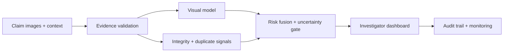

# VeriClaim AI

Evidence intelligence for vehicle-insurance claim triage. VeriClaim combines a cross-fitted, imbalance-aware image ensemble with near-duplicate retrieval, integrity checks, evidence-quality scoring and a human review workflow.

> Important: this is decision support, not an automatic claim-denial system. A trained investigator must make the final disposition.

## What is novel

Most image classifiers stop at “fraud / non-fraud.” VeriClaim treats fraud detection as an evidence-integrity workflow:

1. **Five-signal risk fusion** — visual model, archive similarity, image integrity, amount mismatch and evidence quality.
2. **Transformation-resistant Evidence DNA** — exact hashes, normalized perceptual signatures and dense regional descriptors search prior submitted claims after resizing, compression, rotation, mirroring, inversion and cropping.
3. **Uncertainty-aware routing** — low-risk claims can be fast-tracked; ambiguous cases go to review; high-risk cases are prioritized.
4. **Human-readable evidence** — each recommendation exposes component scores, image metadata and limitations.
5. **Leakage-aware evaluation** — perceptual-image clusters stay within folds, and both exact and perceptual train/test overlap are reported.
6. **CPU-first deployment** — the complete demo runs without TensorFlow, PyTorch, a GPU or a cloud account.

## Included

- Public insurance homepage plus customer and role-protected staff portals
- Guided claim filing, optional incident type, mixed evidence intake and auto-saved drafts
- Claim timeline, in-app notifications, secure claim messaging and searchable support
- Staff fraud alerts, verification checklist, approval workflow and analytics
- **Secure Claim Passport** for repeat claims: a short-lived, one-time,
  account-and-policy-bound token with rotation, replay protection and durable
  local audit records; it is separate from the fraud score
- Cross-claim Evidence DNA screening that identifies exact, transformed and
  partial-region reuse, links the earlier claim ID and routes the case to a
  human investigator without treating a match as proof of fraud
- Standalone public Model Lab for testing one image without creating a claim
- Staff-downloadable investigation evidence PDF with model signals and governance note
- VeriTrust Guardian: Scam Shield, claim-rights guidance, evidence receipts and accident-response coach
- REST-style inference API using Python’s standard library
- Reproducible training/evaluation pipeline
- Saved, tested class-balanced model artifact
- Dataset downloader
- Model card, architecture, delivery estimate, roadmap and demo script
- Container and CI templates
- Hackathon pitch deck (distributed beside the source package)

## Repository map

The repository is organized by responsibility: browser UI in `app/static`,
runtime and training code in `src/vericlaim`, automated checks in `tests`,
operational utilities in `scripts`, technical documentation in `docs`, curated
submission files in `output`, and only the model artifacts required by the demo
in `models`. See [docs/repository_structure.md](docs/repository_structure.md)
for the complete version-control policy.

## Quick start

Use Python 3.11 or newer.

```bash
python -m venv .venv
source .venv/bin/activate          # Windows: .venv\Scripts\activate
pip install -r requirements.txt
python server.py
```

On Windows, the verified setup is:

```powershell
python -m venv .venv
.venv\Scripts\python.exe -m pip install -r requirements.txt
.venv\Scripts\python.exe server.py
```

Open `http://127.0.0.1:8080`.

## Cloud demo deployment

The project includes a free-tier-aware Azure Container Apps deployment script.
It uses a single CPU replica at most and scales to zero when idle. Read
[`docs/azure_free_tier_deployment.md`](docs/azure_free_tier_deployment.md)
before running it: cloud deployment requires your own Azure login and may incur
charges beyond the account's free allowance.

Local demo accounts:

- Customer: `customer@vericlaim.demo` / `CustomerDemo!2026`
- Staff: `staff@vericlaim.demo` / `StaffDemo!2026`

Passwords are PBKDF2-hashed and sessions use opaque HttpOnly, SameSite cookies.
Accounts, cases, Claim Passport history and Evidence DNA are persisted in the
local SQLite demo store. Production deployment still needs HTTPS, encrypted
managed storage, a managed identity provider and email/SMS delivery providers.

## Reproduce training

Download and unpack the source dataset:

```bash
python scripts/download_dataset.py --output data
```

Train and evaluate:

```bash
PYTHONPATH=src python -m vericlaim.train \
  --data-root ../../dataset1/Insurance-Fraud-Detection/Insurance-Fraud-Detection \
  --output-dir models \
  --cache-dir .cache
```

The source dataset contains 5,200 training images and 1,416 test images. Fraud prevalence differs by split and is low, so prioritize fraud recall, PR-AUC, F-scores and the confusion matrix—not accuracy alone. Training retains every image: class-weighted full-data learners are stacked with rotating balanced-subset learners, without external data or synthetic rows. Validation groups close perceptual hashes before splitting, and the report discloses perceptual overlap in the supplied test split.

The deployed neural route uses a frozen ImageNet-pretrained EfficientNetV2B0
backbone with grouped fraud-weighted heads, the ExtraTrees/MLP ensemble,
label-aware archive similarity and Platt probability calibration. Install
`requirements-deep.txt` and run `python -m vericlaim.train_efficientnet_hybrid`
to reproduce it. No additional insurance-claim dataset or synthetic claim row
is used; the CNN backbone starts from standard ImageNet transfer weights.

## Controlled stronger-CNN experiment

The deployed model is intentionally not overwritten by experiments. To test a
stronger visual route, install `requirements-deep.txt` and run:

```bash
PYTHONPATH=src python -m vericlaim.train_finetuned_efficientnet \
  --data-root ../../dataset1/Insurance-Fraud-Detection/Insurance-Fraud-Detection \
  --output-dir models/finetuned_efficientnet_candidate
```

This candidate fine-tunes only the final EfficientNetV2B0 layers with small,
claim-safe augmentation (flip, modest rotation/zoom/contrast) and
class-balanced focal loss. It uses perceptual-image grouped folds, saves a
separate artifact per fold, and writes `candidate_metrics.json`. Promote it
only if its grouped out-of-fold fraud recall, PR-AUC, calibration and false
positive workload improve—not merely its supplied-test accuracy. The Model Lab
also exposes a CNN attention map as a visual aid; it is not proof of fraud.

## API

### `POST /api/analyze`

```json
{
  "claimant": "Ananya Rao",
  "policy_id": "POL-2026-0419",
  "claim_amount": 125000,
  "incident_type": "Collision",
  "images": [
    {"name": "damage.jpg", "data_url": "data:image/jpeg;base64,..."}
  ]
}
```

Returns the fused risk score, route recommendation, component signals, policy guardrail and per-image forensic results.

### Operational risk bands

The website separates the binary model output from operational action. The grouped-validation
**manual-review alert** threshold drives the Model Lab `FRAUD` / `NOT FRAUD` screen. A stricter
**high-confidence alert** threshold prioritizes the most suspicious evidence for investigators.
Scores below the alert threshold are shown as **No fraud alert**, not confirmed non-fraud. Medium
and high bands remain human-review decisions; no threshold automatically denies a claim.

Other endpoints:

- `GET /api/health`
- `GET /api/model-card`
- `GET /api/cases`
- `POST /api/cases/{case_id}/decision`

## Tests

```bash
PYTHONPATH=src python -m unittest discover -s tests -v
```

## Architecture at a glance



See [docs/architecture.md](docs/architecture.md) for deployment alternatives and [docs/model_card.md](docs/model_card.md) for intended use and limitations.

## Data and responsible use

Source: [Kaggle — Car Insurance Fraud Detection](https://www.kaggle.com/datasets/pacificrm/car-insurance-fraud-detection).

The dataset provides image-level fraud labels but no claim adjudication record, policy context, claimant history, repair estimate or demographic audit fields. Therefore:

- do not interpret the model score as proof of deception;
- do not deny, cancel or price a policy automatically;
- validate on insurer-owned temporal data before production;
- monitor drift, calibration, override rates and subgroup performance;
- retain the original evidence and investigator rationale.

## License

Prototype source code is provided for hackathon and educational use. Dataset rights remain with the dataset publisher; review the Kaggle data page before redistribution or commercial use.
