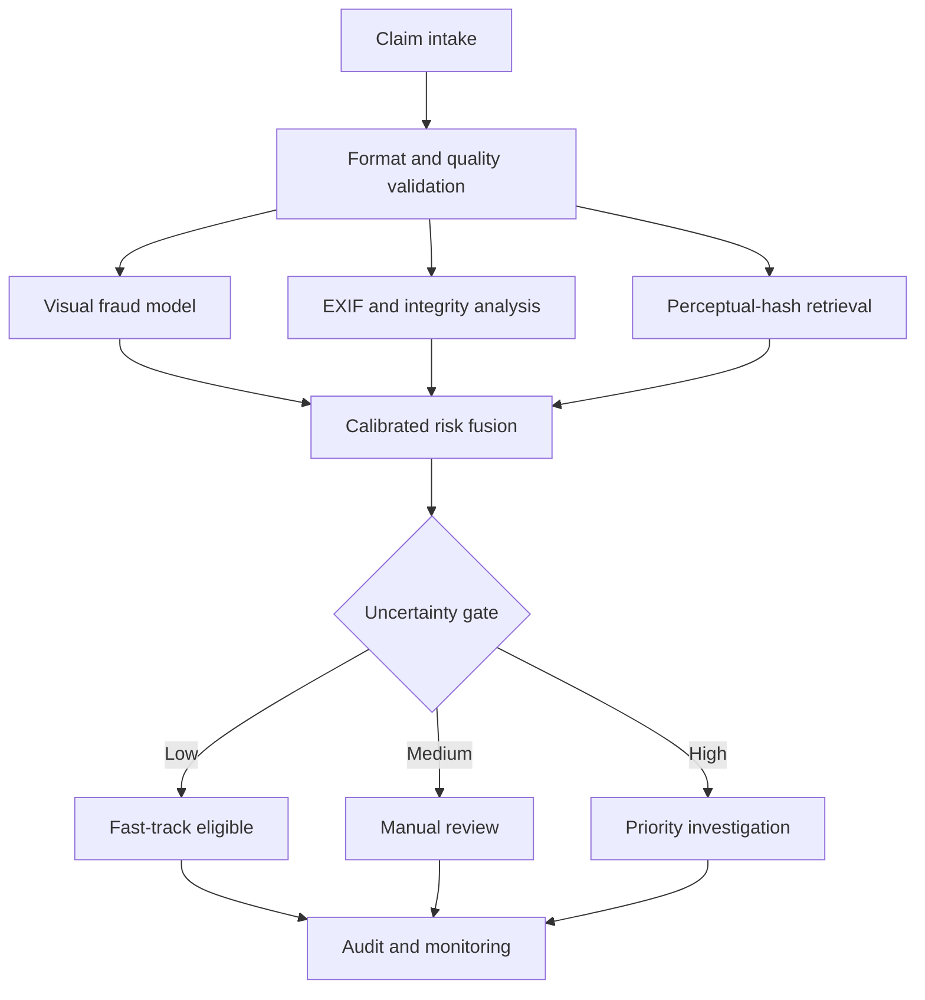

# Solution architecture

## Design objective

Produce a review-ready evidence package in seconds while keeping claim adjudication with an authorized human.

## Logical flow



## Prototype components

| Component | Prototype choice | Production alternative |
|---|---|---|
| Image intake | Base64 JSON over HTTPS | Object storage presigned upload with malware scanning |
| Visual model | Calibrated hybrid: frozen EfficientNetV2B0 ImageNet backbone + 5 grouped sigmoid heads + 5 MLPs + 5 class-weighted ExtraTrees + 20 rotating balanced ExtraTrees | Fine-tuned EfficientNet/ConvNeXt with insurer-owned temporal validation |
| Duplicate retrieval | Perceptual hash and Hamming distance | Embedding vector database with claim-level entity graph |
| Image integrity | EXIF, editor tags, quality and compression proxies | Dedicated manipulation detector and C2PA verification |
| Risk fusion | Cross-fitted class-weighted logistic stacker with Platt probability calibration | Validated stacking model plus configurable business rules |
| API | Python standard-library HTTP server | FastAPI/gRPC behind an API gateway |
| Case queue | In-memory session store | PostgreSQL + event stream + insurer case-management integration |
| Monitoring | Model-card endpoint | Drift, calibration, latency, override and fairness dashboards |

## Risk fusion

The prototype score is intentionally legible:

```text
risk = 0.74 visual_model
     + 0.18 confirmed_fraud_archive_similarity
     + 0.08 image_integrity
```

Evidence quality, legitimate-reference similarity and amount consistency remain visible to the investigator but do not independently increase the fraud score. Weights are a demonstration policy, not production coefficients. They must be validated against insurer losses, investigator capacity and false-positive costs.

## Security and privacy

- Reject unsupported types and images over the configured limit.
- Decode server-side; do not trust extensions or browser MIME labels.
- Use encryption in transit and at rest in production.
- Tokenize policy and claimant identifiers before analytics.
- Set evidence retention by jurisdiction and policy requirements.
- Separate model recommendation from the authoritative claims record.
- Log model version, threshold, component scores, reviewer action and reason.
- Run third-party image parsers in a sandboxed worker in production.

## Deployment alternatives

### Hackathon / local

Single process, CPU inference, static dashboard and saved model artifact. Best for a reliable offline demo.

### Cloud pilot

API gateway → validation worker → model service → vector search → case database → dashboard. Add object storage, identity, secrets management, queue-based retries and centralized observability.

### Enterprise integration

Publish a `ClaimEvidenceAssessed` event and attach the returned risk package to the existing claims platform. Preserve asynchronous operation so an ML outage does not block claim intake.
