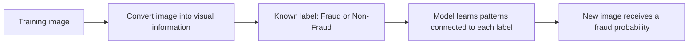
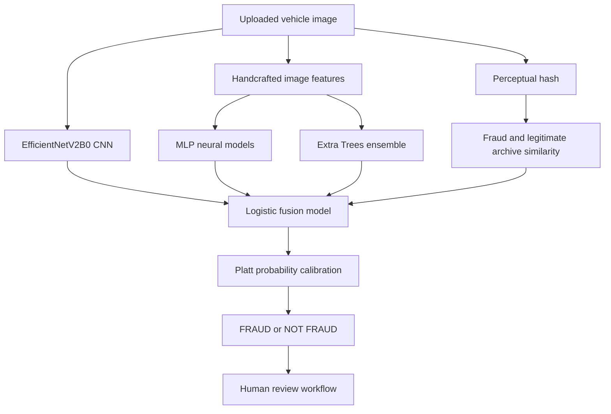

# VeriClaim AI — Developer Study Guide

This guide is for a new developer who knows basic Python but may be new to machine learning, deep learning, insurance fraud, or this codebase.

Its goal is simple: after reading this document, you should understand **what the project does, why each model exists, how an image becomes a fraud-risk result, and where to change the code safely**.

---

## 1. What problem does VeriClaim solve?

VeriClaim is a **vehicle-insurance evidence triage prototype**.

A customer uploads vehicle-damage images. The system analyses the images and produces a fraud-risk signal for a human investigator.

It does **not** automatically reject claims. A positive result means:

> “This image has patterns similar to fraud-labelled examples in the training data. Please review it.”

The project has two parts:

1. **Fraud-screening model** — estimates fraud risk from a vehicle-damage image.
2. **Insurance workflow website** — lets customers submit evidence and lets staff review the model's evidence package.

---

## 2. The most important idea: this is supervised learning

The dataset contains photos with an answer already attached:

```text
Image A → Fraud
Image B → Non-Fraud
```

Training means showing the model many examples like this so it can learn statistical visual differences between the two groups.



The model does not understand fraud as a human does. It cannot know intent, policy history, or whether an accident story is true. It learns correlations between image patterns and the labels in this dataset.

---

## 3. Dataset used

Only the supplied car-insurance fraud dataset is used for fraud-specific training.

| Split | Total images | Fraud | Non-Fraud | Fraud rate |
|---|---:|---:|---:|---:|
| Train | 5,200 | 200 | 5,000 | 3.85% |
| Test | 1,416 | 93 | 1,323 | 6.57% |

### The target variable

```text
Fraud     = 1
Non-Fraud = 0
```

The label is attached to the **whole image**. The dataset does not contain labels such as:

- tire damage
- bumper dent
- collision damage
- weather damage
- damage severity
- damaged-object bounding boxes

This is why VeriClaim is an **image-level fraud classifier**, not a damage-localisation system.

---

## 4. Why class imbalance is a problem

There are many more normal images than fraud images:

```text
5,000 Non-Fraud images
  200 Fraud images
```

That is roughly:

```text
1 Fraud : 25 Non-Fraud
```

If a lazy model predicts `Non-Fraud` for every image in the supplied test split, it would get about 93.43% accuracy, but find **zero** fraud images.

Therefore, normal accuracy alone is not enough. We must track fraud recall, precision, PR-AUC and the confusion matrix.

---

## 5. How the project handles imbalance

We use **cost-sensitive balanced ensemble learning with rotating under-sampling and recall-aware threshold tuning**.

This sounds complex, but it has three simple parts.

### A. Class weighting: fraud mistakes matter more

The model is told that missing fraud is more costly than making one normal-image mistake.

Approximate weight ratio:

```text
Non-Fraud image importance = 1
Fraud image importance     = 25
```

The ratio comes from the dataset:

```text
5,000 Non-Fraud ÷ 200 Fraud = 25
```

This is used by the CNN fraud heads, MLP, full Extra Trees models and fusion model.

### B. Rotating balanced ensemble: fairer practice groups

The fraud-focused Extra Trees models do not use all 5,000 normal images at once. Each one sees:

```text
All fraud images
+ a different group of normal images
```

Approximate group ratio:

```text
1 Fraud : 8 Non-Fraud
```

Example:

```text
Model 1 → all fraud images + normal group A
Model 2 → all fraud images + normal group B
Model 3 → all fraud images + normal group C
```

Across the complete ensemble, all normal images are used. They are not permanently discarded.

### C. Threshold tuning: the decision line is not automatically 50%

A probability needs a cutoff:

```text
Above cutoff → FRAUD
Below cutoff → NOT FRAUD
```

We select the cutoff from grouped validation data to balance missed fraud against false alerts. The Model Lab uses the balanced binary threshold. Claim screening uses a lower high-recall threshold because it sends cases to people for review.

### Why not SMOTE?

SMOTE is mainly intended for numeric tabular data. Creating synthetic mixed vehicle images could produce unrealistic evidence and weaken trust.

### Why not rely only on data augmentation?

Augmentation creates small variations of the same image, such as a slightly brighter or rotated copy. It can help later, but it does not create new real fraud situations. The current deployed model uses the original claim images and weighting/ensemble balancing as its main imbalance solution.

---

## 6. Current deployed model

The website currently uses:

> **Calibrated EfficientNetV2B0 CNN + MLP + Extra Trees + archive similarity hybrid**



### 6.1 EfficientNetV2B0 CNN

EfficientNetV2B0 is the main deep-learning image model.

It receives a 224 × 224 image and turns it into 1,280 visual numbers, called an **embedding**.

Think of an embedding as a compact visual summary:

```text
Image pixels
→ lines, colours, textures, shapes
→ vehicle and damage-related visual patterns
→ 1,280-number summary
```

Five fraud-weighted sigmoid heads use these summaries to estimate fraud probability. The backbone begins with standard ImageNet transfer weights, but the fraud heads are trained using only the supplied insurance images.

### 6.2 MLP neural network

The MLP is a smaller neural network that works with engineered image features instead of raw pixels.

```text
794 image features
→ Dense layer: 128 ReLU neurons
→ Dense layer: 32 ReLU neurons
→ Fraud probability
```

### 6.3 Extra Trees models

Extra Trees is a large collection of decision trees. Each tree makes a small decision based on image features. Their predictions are averaged.

The project has:

- 5 full-data class-weighted Extra Trees models
- 20 rotating balanced Extra Trees models

### 6.4 Archive similarity

Each image receives a **perceptual hash**, a short visual fingerprint.

The system compares that fingerprint with known Fraud and Non-Fraud reference images.

This helps find possible near-duplicate or visually similar evidence. It is a clue, not proof of fraud.

### 6.5 Fusion and probability calibration

Different models can disagree. The fusion model combines their opinions:

```text
CNN opinion
+ MLP opinion
+ Extra Trees opinion
+ archive similarity
= one fused fraud score
```

Platt calibration then adjusts the score so it better reflects the low real fraud rate in the dataset.

---

## 7. How one uploaded image is analysed

```text
1. User uploads an image.
2. Server checks file type and decodes the image.
3. The CNN reads the image pixels.
4. Feature extractor calculates colour, texture, sharpness and edge features.
5. Perceptual hashing searches the labelled archive.
6. CNN, MLP and Extra Trees produce probabilities.
7. Fusion model combines them.
8. Calibration adjusts the final probability.
9. The threshold converts the probability into FRAUD or NOT FRAUD.
10. Website shows the result, evidence quality and similarity clues.
```

### Example

```text
EfficientNet CNN:     99.5% fraud-like visual pattern
MLP / trees:          additional opinions
Archive search:        similarity context
Fused calibrated risk: 49.1%
Binary threshold:      6.12%
Final result:          FRAUD
```

The low-looking threshold is normal after calibration because fraud is rare. It is not proof that an image is fraudulent.

---

## 8. Current evaluation results

At the balanced Model Lab threshold, the current EfficientNet hybrid achieved the following on the supplied test split:

| Metric | Result | Plain-English meaning |
|---|---:|---|
| Accuracy | 96.12% | All correct predictions together |
| Balanced accuracy | 94.42% | Fairer score across Fraud and Non-Fraud |
| Fraud recall | 92.47% | Finds about 92 out of 100 fraud images |
| Precision | 64.18% | About 64 out of 100 alerts are fraud images |
| F1 score | 75.77% | Balance of recall and precision |
| PR-AUC | 90.48% | Ranking quality for a rare-fraud problem |
| ROC-AUC | 97.59% | Overall separation quality |

Confusion matrix:

| Actual / Predicted | Non-Fraud | Fraud |
|---|---:|---:|
| Non-Fraud | 1,275 correct | 48 false alerts |
| Fraud | 7 missed | 86 correct alerts |

### Important warning about these numbers

The supplied test split has substantial visual/perceptual overlap with the training split. Around 53.7% of test images have a close training-image match under the perceptual-hash check.

Therefore, these metrics are appropriate for the hackathon demonstration but must not be claimed as guaranteed real-world insurer performance.

---

## 9. Project folders and important files

```text
vericlaim-ai/
├── server.py                         Local website and API server
├── app/static/
│   ├── index.html                    Website structure
│   ├── app.js                        Website behaviour and Model Lab UI
│   └── styles.css                    Website design
├── src/vericlaim/
│   ├── features.py                   Image features, quality, EXIF and pHash
│   ├── model.py                      Loads models and runs inference
│   ├── train.py                      Original Extra Trees + MLP hybrid training
│   ├── train_efficientnet_hybrid.py  Current EfficientNet hybrid training
│   ├── train_deep.py                 Optional older deep-learning experiment
│   └── validation.py                 Perceptual grouping and leakage checks
├── models/
│   ├── efficientnet_hybrid/          Current deployed artifact and CNN backbone
│   ├── neural_candidate/             Previous MLP hybrid benchmark
│   └── vericlaim_model.joblib        Earlier tree-only benchmark
├── tests/                            Automated tests
└── docs/                             Architecture, model card and demo material
```

---

## 10. Where to find each feature in code

| Feature | File to study first |
|---|---|
| Website routes and API responses | `server.py` |
| Current model training | `src/vericlaim/train_efficientnet_hybrid.py` |
| Inference on an uploaded image | `src/vericlaim/model.py` |
| Image feature extraction | `src/vericlaim/features.py` |
| Leakage audit and grouped validation | `src/vericlaim/validation.py` |
| Model Lab UI | `app/static/app.js` and `app/static/index.html` |
| Visual styling | `app/static/styles.css` |
| Model limitations and intended use | `docs/model_card.md` |

---

## 11. How to run the website locally

From the project folder:

```powershell
.venv\Scripts\python.exe server.py
```

Then open:

```text
http://127.0.0.1:8080/
```

Model Lab:

```text
http://127.0.0.1:8080/#model-lab
```

### Demo accounts

```text
Customer: customer@vericlaim.demo
Password: CustomerDemo!2026

Staff: staff@vericlaim.demo
Password: StaffDemo!2026
```

The prototype uses in-memory state. Claims, messages and newly created accounts reset when the server restarts.

---

## 12. How to retrain the current model

The EfficientNet hybrid needs TensorFlow in the virtual environment.

```powershell
.venv\Scripts\python.exe -m pip install -r requirements-deep.txt
```

Run training:

```powershell
$env:PYTHONPATH = "src"
.venv\Scripts\python.exe -m vericlaim.train_efficientnet_hybrid `
  --data-root "C:\path\to\Insurance-Fraud-Detection" `
  --output-dir models\efficientnet_hybrid `
  --cache-dir .cache
```

Training creates:

```text
models/efficientnet_hybrid/vericlaim_model.joblib
models/efficientnet_hybrid/efficientnetv2b0_backbone.keras
models/efficientnet_hybrid/model_metrics.json
```

Do not replace the live model until you have reviewed the metrics, tested known fraud and non-fraud images, and checked that the server starts successfully.

---

## 13. How to test changes

Run automated tests:

```powershell
$env:PYTHONPATH = "src"
.venv\Scripts\python.exe -m unittest discover -s tests -q
```

Then manually test Model Lab with:

1. A known Fraud image from the supplied test folder.
2. A known Non-Fraud image from the supplied test folder.
3. A poor-quality image.
4. A tire-only or unusual image.

For each test, check:

- Does the page show the current and previous model comparison?
- Does it show probability and threshold?
- Is the verdict understandable?
- Does it clearly say this is screening, not proof?

---

## 14. What the project can and cannot say

### Safe claims

- “The system is a supervised image-based fraud screening prototype.”
- “It combines EfficientNetV2B0, MLP, Extra Trees and archive similarity.”
- “It is designed to prioritise cases for human review.”
- “It was evaluated on the supplied test split.”
- “It uses class weighting and rotating balanced ensembles for imbalance.”

### Claims to avoid

- “The model proves fraud.”
- “The model can reject a claim automatically.”
- “The model understands the cause of every accident.”
- “The model identifies every damage type.”
- “The test accuracy guarantees production performance.”
- “The system uses YOLO or damage segmentation.”

---

## 15. Standout features of the project

VeriClaim is not only an image classifier. The differentiating idea is that it turns an image upload into a small, review-ready evidence package.

### 15.1 Calibrated multi-model fraud screening

Most basic projects use one CNN and show a single percentage. VeriClaim combines deep visual learning, engineered image features, image similarity and calibration.

```text
One uploaded image
→ several independent model opinions
→ one calibrated risk score
→ human investigator reviews the evidence
```

Why this matters:

- one model's mistake is less likely to control the full result
- the result includes more evidence than a raw CNN score
- probability calibration makes the output more suitable for rare-fraud data

### 15.2 Model Lab with model-generation comparison

Model Lab lets a user upload one image and compare:

- current EfficientNetV2B0 hybrid
- previous MLP hybrid
- standalone EfficientNet CNN probability
- final fused calibrated probability

It also shows accuracy, balanced accuracy, recall, precision, PR-AUC, thresholds and confusion-matrix counts for both generations.

Why this matters:

> It demonstrates measurable improvement instead of simply claiming that a newer model is better.

### 15.3 Claim DNA Passport

The Claim DNA Passport converts uploaded evidence into an understandable profile:

- evidence coverage: how many useful image views are present
- diversity: whether uploads are different viewpoints or repeats
- quality: focus, exposure and resolution
- integrity: metadata and editing signals
- coaching: suggestions such as adding wider, closer or clearer views

Why this matters:

> It improves the evidence before an investigator spends time on it.

### 15.4 Claim Twin Radar

The Twin Radar compares an image with:

- labelled fraud archive images
- labelled legitimate archive images
- other images inside the same submitted claim

It uses perceptual hashes to identify visual similarity and possible image reuse.

Why this matters:

> Reused imagery is an important investigation clue, even when a classifier alone is uncertain.

### 15.5 Human-in-the-loop fraud governance

The website deliberately avoids automatic denial. Staff can review a claim and record:

```text
Confirmed fraud
Legitimate
Inconclusive
```

The model recommendation, reviewer feedback and evidence summary remain visible together.

Why this matters:

> It is safer, more realistic for insurance operations and easier to defend than an automatic fraud verdict.

### 15.6 Evidence integrity, receipts and reports

Each image can include:

- SHA-256 fingerprint
- perceptual hash
- EXIF and GPS presence
- editing-software indicator
- quality score

The project can generate customer evidence receipts and staff-facing PDF evidence reports.

Why this matters:

> It treats uploaded photos as evidence, not just as pixels for a model.

### 15.7 Customer fraud-protection tools

The customer portal includes a trust and rights area with:

- scam-message warning guidance
- claim-rights and escalation guidance
- first-ten-minutes accident coach
- evidence receipt access

Why this matters:

> The project addresses fraud prevention for customers as well as fraud detection for insurers.

### 15.8 Transparent imbalance and leakage disclosure

The project shows fraud-focused metrics and explains that the supplied test split contains perceptual overlap with training images.

Why this matters:

> Honest evaluation is a standout feature. A high score without discussing leakage is not trustworthy.

---

## 16. Future work roadmap

The items below are deliberately ordered by practical value and data availability.

### Phase 1 — Improve explanation and trust

#### Add Grad-CAM heatmaps

Grad-CAM would highlight the areas of an image that influenced the EfficientNet prediction.

```text
Uploaded tire image
→ red/yellow region = strong CNN attention
→ blue region = low CNN attention
```

This would help an investigator see whether the CNN focused on the tire/damage or on an irrelevant background.

#### Add confidence and out-of-scope warnings

Examples:

- “This is a tire-only image; confidence may be lower because the training data mainly contains full damage scenes.”
- “Image quality is too low for reliable screening.”
- “No sufficiently similar archive evidence was found.”

### Phase 2 — Improve visual damage understanding

#### Add damage localisation

Use YOLO, segmentation, or a detection model only after collecting annotations such as:

```text
bounding box around tire
bounding box around dent
bounding box around crack
damage type label
damage severity label
```

The current Fraud/Non-Fraud labels alone are not sufficient to train a trustworthy object detector.

#### Carefully test mild augmentation

Possible training-only transformations:

- small brightness change
- small contrast change
- small rotation
- small zoom
- horizontal flip only when vehicle orientation is not meaningful

Never augment validation or test images. Compare the augmented candidate against the current model with the same grouped-validation protocol.

### Phase 3 — Add lawful claim metadata fusion

Potential future features:

- policy age
- claim amount
- vehicle age and model
- repair estimate
- number of previous claims
- time between policy issue and accident
- device and upload consistency signals

This could support an image-plus-metadata fusion model, but only after data-quality, privacy, fairness and governance checks.

### Phase 4 — Production engineering

Replace the local prototype infrastructure with:

- encrypted object storage for evidence
- PostgreSQL or another persistent case database
- managed identity provider and HTTPS
- malware scanning for uploads
- background job queue for model inference
- audit logging and retention controls
- insurer claims-system API integration

### Phase 5 — Production evaluation and monitoring

Before real deployment:

1. Obtain a new time-separated insurer dataset.
2. Group records by claim, vehicle and claimant so close cases do not leak between train and test.
3. Evaluate false-positive cost, missed-fraud cost and investigator workload.
4. Run the model in shadow mode before using it for triage.
5. Monitor probability calibration, fraud recall, reviewer overrides and evidence-quality drift.
6. Establish a formal rollback process for every model release.

---

## 17. How to learn the project completely

The guide is detailed enough to understand the project from start to finish, but no document replaces running the project and tracing one image through the code.

Use this practical learning exercise:

1. Start the website and open Model Lab.
2. Upload one supplied Fraud image and write down the CNN and fused probabilities.
3. Upload one supplied Non-Fraud image and compare the result.
4. Open `server.py` and find the `/api/model-test` route.
5. Open `model.py` and trace `analyze_image()`.
6. Open `features.py` and identify the quality score and perceptual hash.
7. Open `train_efficientnet_hybrid.py` and find the CNN, MLP, Extra Trees, fusion and calibration stages.
8. Compare the current model with the previous MLP model in Model Lab.
9. Read `model_metrics.json` and match each number to the website scoreboard.
10. Read the limitations before proposing any model change.

When a developer can trace one image through these ten steps, they understand the complete working system rather than only the model names.

---

## 18. Recommended next improvements

### Highest-value improvement: Grad-CAM explanation

Grad-CAM would add a heatmap to show which regions of the image influenced EfficientNet's decision.

This would help answer:

> “Did the CNN focus on the tire damage, or on an irrelevant background?”

### Other future improvements

1. Add true damage localisation only after collecting bounding-box or segmentation labels.
2. Add insurer metadata, such as policy age, claim amount and repair estimate, after lawful governance and quality checks.
3. Run time-separated evaluation with new claims and claim-level grouping.
4. Add mild training-only augmentation after a careful experiment.
5. Add persistent database, object storage, HTTPS and production identity management.
6. Monitor drift, calibration, reviewer overrides and false-positive rates after deployment.

---

## 19. A short presentation explanation

Use this if you need to explain the project simply:

> “VeriClaim is a supervised fraud-screening system for vehicle-damage evidence. It learns from images already labelled Fraud or Non-Fraud. Because fraud examples are rare, we use cost-sensitive learning and rotating balanced ensembles so fraud images receive more attention. Our deployed hybrid combines EfficientNetV2B0 visual learning, MLP and Extra Trees opinions, archive similarity and probability calibration. The result is an explainable fraud-risk signal for human review, not an automatic claim decision.”

---

## 20. Glossary

| Term | Simple meaning |
|---|---|
| Supervised learning | Learning from examples that already have answers/labels |
| Label | The correct category, such as Fraud or Non-Fraud |
| Feature | A measurable image property, such as colour, edge density or texture |
| CNN | A neural network designed to learn image patterns |
| EfficientNetV2B0 | The CNN used for visual image embeddings in this project |
| MLP | A smaller neural network that learns from prepared numeric features |
| Extra Trees | Many decision trees voting together |
| Ensemble | Multiple models combined into one result |
| Class imbalance | One category has far more examples than another |
| Class weighting | Making rare fraud examples count more during training |
| Under-sampling | Training with a smaller temporary selection of the majority class |
| Rotating ensemble | Different models see different temporary selections, then vote together |
| Threshold | The score line that changes probability into FRAUD or NOT FRAUD |
| Recall | Percentage of real fraud images found |
| Precision | Percentage of fraud alerts that are actually fraud |
| PR-AUC | A useful ranking metric when fraud is rare |
| Calibration | Adjusting probabilities so they better match observed risk |
| Perceptual hash | A short visual fingerprint used to find similar images |
| Leakage | Accidentally letting training information influence evaluation |

---

## 21. Suggested learning order for a new developer

1. Read this guide once without opening code.
2. Run the website and use Model Lab.
3. Read `server.py` to understand request and response flow.
4. Read `features.py` to understand image measurements.
5. Read `model.py` to see how model predictions are combined.
6. Read `train.py` to understand the original ensemble and imbalance strategy.
7. Read `train_efficientnet_hybrid.py` to understand the current CNN hybrid.
8. Read `validation.py` and `docs/model_card.md` before changing evaluation.
9. Make one small UI or API change and run the tests.
10. Only then experiment with model architecture or thresholds.

This order helps developers understand the system before changing the model.
