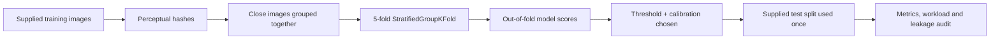

# Model Performance Report

## Executive summary

VeriClaim is designed for **triage**, not automatic fraud decisions. The important question is therefore not “which model has the highest accuracy?” but “which configuration identifies suspicious claims with a manageable false-positive workload and reliable probabilities?”

The dataset has 5,200 training images with 200 fraud labels (3.85%) and 1,416 supplied test images with 93 fraud labels (6.57%). Because fraud is rare, an accuracy-only model can look strong while failing the claims that need attention. We report precision, recall, F1, PR-AUC, Brier score, threshold and confusion matrix.

## Evaluation protocol



- **Grouped folds:** visually similar images are kept in the same fold where possible.
- **No external insurance-claim data:** every learner uses only the supplied claim images; ImageNet weights are generic transfer-learning weights, not another claim dataset.
- **All supplied images retained:** full-data class-weighted learners are combined with 20 rotating balanced learners at an 8:1 non-fraud-to-fraud ratio.
- **Two operating thresholds:** a high-recall review alert supports triage; a classification threshold powers the Model Lab display.

## Configuration comparison

All values below are from saved metric artefacts and use the supplied test split at their stated **classification** thresholds.

| Rank by F1 | Configuration | Precision | Recall | F1 | F2 | PR-AUC | ROC-AUC | Brier ↓ |
| ---: | --- | ---: | ---: | ---: | ---: | ---: | ---: | ---: |
| 1 | EfficientNetV2B0 CNN + Extra Trees + MLP + archive fusion | **64.18%** | **92.47%** | **75.77%** | **84.98%** | **90.48%** | **97.59%** | **0.0252** |
| 2 | GPU fine-tuned EfficientNetV2-S candidate + focal loss | 54.17% | 83.87% | 65.82% | 75.58% | 82.64% | 97.42% | 0.0271 |
| 3 | Precision-oriented Extra Trees ensemble | 61.54% | 51.61% | 56.14% | 53.33% | 64.48% | 91.83% | 0.1043 |
| 4 | MLP + Extra Trees hybrid ensemble | 25.76% | 81.72% | 39.18% | 56.97% | 64.38% | 91.83% | 0.1041 |
| 5 | Recall-oriented Extra Trees ensemble | 24.36% | 81.72% | 37.53% | 55.56% | 64.48% | 91.83% | 0.1043 |

### Visual comparison

```text
F1 score                         Precision                         Recall
EfficientNet hybrid  75.77% ███████████████░░░░░  EfficientNet hybrid 64.18% █████████████░░░░░░░  EfficientNet hybrid 92.47% ██████████████████░
GPU candidate        65.82% █████████████░░░░░░░  Precision ExtraTrees 61.54% ████████████░░░░░░░░  GPU candidate        83.87% █████████████████░░░
Precision ExtraTrees 56.14% ███████████░░░░░░░░░  GPU candidate        54.17% ███████████░░░░░░░░░  MLP + ExtraTrees     81.72% ████████████████░░░░
MLP + ExtraTrees     39.18% ████████░░░░░░░░░░░░  MLP + ExtraTrees     25.76% █████░░░░░░░░░░░░░░░  Recall ExtraTrees    81.72% ████████████████░░░░
```

## Best reported hybrid configuration

At the Model Lab classification threshold of **0.0612**, the saved hybrid metric artefact reports:

| | Predicted no fraud alert | Predicted fraud alert |
| --- | ---: | ---: |
| **Actually non-fraud** | 1,275 | 48 |
| **Actually fraud** | 7 | 86 |

Interpretation:

- It detects **86 of 93** labelled fraud images in the supplied test split.
- It produces **48** alerts on labelled non-fraud images.
- Precision is 64.18%: among alerts, roughly 64 in 100 are labelled fraud in this test set.
- Recall is 92.47%: it catches roughly 92 in 100 labelled fraud images.

## Calibration and thresholding

The component learners have different score distributions. A stacking logistic-regression layer combines them, then **Platt scaling** calibrates the score against out-of-fold labels. Calibration does not make the model “more accurate”; it makes a score closer to a usable probability so a threshold can be chosen deliberately.

| Operating mode | Threshold | Purpose | Trade-off |
| --- | ---: | --- | --- |
| Review alert | 0.0052 | Catch nearly all candidates for investigator review | Very high recall; many false positives |
| Model Lab classification | 0.0612 | Present a clearer fraud-alert / no-alert demonstration | Better precision and lower review load |
| High-confidence investigation | 0.4842 | Prioritize the most suspicious cases | Lower volume; does not replace human review |

The UI avoids saying “confirmed non-fraud.” A score below the alert threshold means **no fraud alert at that threshold**, not proof that the claim is legitimate.

## Leakage audit and limitation

The supplied test set contains no exact SHA-256 duplicates with the training split. However, the perceptual audit found 761 of 1,416 test images (53.74%) within the configured close-image screen and 261 with an identical perceptual hash. This can inflate apparent supplied-test performance.

For that reason:

1. Grouped out-of-fold validation is the primary development control.
2. The supplied test split is reported transparently, not treated as a production guarantee.
3. Any production deployment must use a temporally separated, insurer-owned holdout set.
4. New model candidates are promoted only when PR-AUC, recall, calibration and review workload improve under the leakage-aware protocol.

## Artefact sources

- Hybrid model: [models/model_metrics.json](../models/model_metrics.json)
- GPU EfficientNet candidate: [models/gpu_efficientnet_candidate/candidate_metrics.json](../models/gpu_efficientnet_candidate/candidate_metrics.json)
- MLP candidate: [models/neural_candidate/model_metrics.json](../models/neural_candidate/model_metrics.json)
- Extra Trees candidate variants: [models/candidate_balanced_lab](../models/candidate_balanced_lab), [candidate_v2](../models/candidate_v2) and [candidate_v2_95](../models/candidate_v2_95)
- Model governance context: [Model Card](model_card.md)
